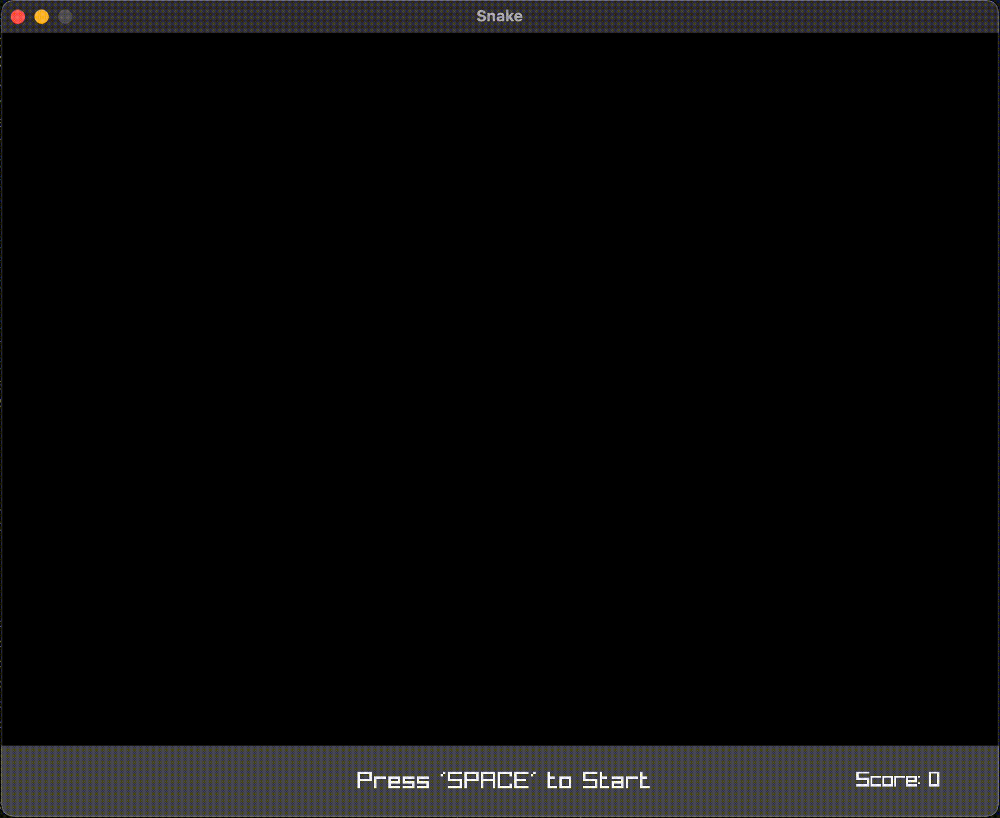

# Snake Game in C++
Snake created in C++ with the Raylib library. 

    

## How to Play

> * Use `ARROW KEYS` to move the snake around the grid

## Files
A list of files that are contained in this repository

> * `images/snake_logo.png`
> * `images/snakegif.gif`
> * `snake.cpp`
> * `main.cpp`
> * `README.md`
> * `LICENSE (MIT)`

## Dependancies
Common dependancies needed for the game to compile and run

> * [`Raylib Library`](https://www.raylib.com)
>       - you can check out the hyperlink for instructions on downloading the library
> * `C++11`

This project is still being maintained at the moment

